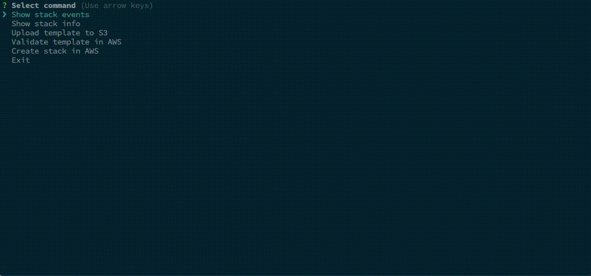

# AWS CloudFormation Stack CLI Helper

An opinionated Command Line utility that aims to help and speed up the development activities associated with the construction of AWS CloudFormation Stacks.

## Common use cases

- Upload stack templates to S3
- View stack information
- View stack events
- Validate template syntax
- Create stack in AWS
- Delete stack in AWS

## Preview



## Installation

You can use the `cf-cli-create-project` script to bootstrap a sample project:

- Create an empty npm project (`npm init`)
- Run `npm install https://github.com/atpollmann/cf-cli-helper`
- Run `./node_modules/.bin/cf-cli-create-project`
- Run `./node_modules/.bin/cf-cli`

Or you can setup one manually:

- Create an empty npm project (`npm init`)
- Create a `templates` folder and put a `main.yml` template inside
- Create a [stack metadata file](#the-stack-metadata) in the root project folder
- Create a `config/default.js` file [with the corresponding configuration values](#the-configuration-file)
- `npm install https://github.com/atpollmann/cf-cli-helper`
- Run `./node_modules/.bin/cf-cli`

## Workflow rationale

- The user builds a CloudFormation template
- With the help of this tool:
  - Upload it to S3 into a bucket.
  - Validate the syntax of the template
  - Deploy the stack
  - View the stack events

## S3 bucket structure

When uploading to S3, the tool places the templates inside the following directory structure:

`<bucket_name>/<domain>/<stack_name>/<stack_version>/`

Where `domain` can be used to aggregate the templates under any given logic. i.e.: `application_x`, `service_x`, `department_x`, `team_x`, etc.

## Work environment structure

The helper assumes the following elements are present in the working environment:

- A `templates` directory that has at least one template in it called `main`
- A `config` directory with a `default.js` config file
- A `stack_metadata.json` file in the root
- An optional `stack_parameters.json` if the stack receives parameters

### The templates folder

All the CloudFormation templates live here. It must be at least one template file called main to bootstrap the creation of the stack.

### The configuration file

```javascript
module.exports = {
  aws: {
    credentialsProfile: "default",
    region: "us-east-1",
    pollingInterval: 1,
    onCreateStackFailure: "ROLLBACK",
    template: "main.yml"
  }
};
```

- `aws.credentialsProfile`: A specific profile that holds the access key and secret in the local `~/.aws/credentials` file
- `aws.region`: The AWS region in which the stack will be deployed
- `aws.pollingInterval`: The CloudFormation poll interval in seconds for the 'view stack events' use case
- `aws.onCreateStackFailure`: What to do when a stack can't be created
- `aws.template`: The template to be deployed. If not set, the default `main` bucket will be deployed'

### The stack metadata

A stack metadata file that contains the following information about the stack:

- `name`: The name of the stack
- `domain`: Any given template aggregation ([refer to S3 bucket structure](#s3-bucket-structure))
- `version`: Current version of the templates ([refer to S3 bucket structure](#s3-bucket-structure))
- `bucket`: The S3 bucket name to put the templates into

## Development

The `NODE_ENV` environment variable will determine the configuration file inside the `config` directory that will be loaded.

For development, it is desirable to specify where the working directory resides by setting a `CF_CLI_WORKING_DIR` environment variable that specifies a path relative to the root of the project. The program will only read this variable when `NODE_ENV` starts with `dev`.

If `NODE_ENV` _does_ start with `dev`, and no `CF_CLI_WORKING_DIR` environment variable exists, the application assumes the path `./dev/dev_workdir` as it's working directory.

When `NODE_ENV` _does not_ start with `dev` (or is not set), the application assumes the `process.cwd()` as it's working directory.

### Examples

`env NODE_ENV=dev-custom node app/cli`
This will set the working directory to `./dev/dev_workdir` and will look for a `./dev/dev_workdir/config/dev-custom` config file

`env NODE_ENV=dev-custom CF_CLI_WORKING_DIR=/users/john/cf_stack node app/cli`
This will set the working directory to `/users/john/cf_stack` and will look for a `/users/john/cf_stack/config/dev-custom` config file

## Tests

To run the tests
`npm test`
